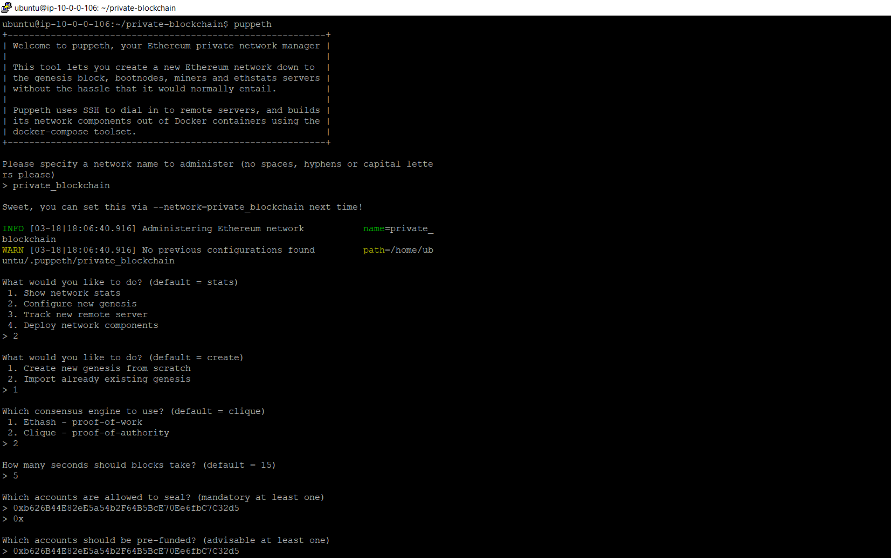

It is a step-by-step guide to setup a private ethereum blockchain multi-nodes (multiple ledgers) network using [geth](https://geth.ethereum.org/).

## Salient Features
- Setup enterprise grade private ethereum blockchain network on multi-nodes (rather solo node)
- Used geth (Official Go implementation of the Ethereum protocol)
- Used clique algorithm (proof-of-authority) as consensis engine.
- Used latest stable official commands as per the year 2022 to setup this network


## Prerequisites
- Create two VMs on any cloud infrastructure or on virtual box (Allow TCP/UDP ports, check firewall, ping/telnet ip port)
  - Please ensure that your bootnode and all other nodes have public IP addresses assigned, and both TCP and UDP traffic can pass the firewall.

- Install Go language [(Refer)](https://go.dev/doc/install)
  - How to install Go language from command terminal (rather GUI)
    > sudo wget https://golang.org/dl/go1.17.6.linux-amd64.tar.gz

    > sudo tar -xzf go1.17.6.linux-amd64.tar.gz -C /usr/local/

    > export PATH=$PATH:/usr/local/go/bin

    > sudo nano /etc/profile

    > export PATH=$PATH:/usr/local/go/bin

    > source /etc/profile

    > go version

- Install Geth [(Refer)](https://geth.ethereum.org/docs/install-and-build/installing-geth)

    > sudo add-apt-repository -y ppa:ethereum/ethereum

    > sudo apt-get update

    > sudo apt-get install ethereum

    > geth version

    The abigen, bootnode, clef, evm, geth, puppeth, rlpdump, and wnode commands are then available on your system in /usr/bin/

    Find the different options and commands available with 'geth --help'.

- Install NodeJS
    > sudo apt update

    > sudo apt install nodejs

    > node -v
    
    > sudo apt install npm
    
    > npm -v

- Install Web3 
    > sudo npm install web3

- (Optional) Install GUI on at least one VM (on BootNode) [(Refer)](https://techworldwithvijaypatel.medium.com/how-to-setup-gui-on-amazon-ec2-ubuntu-server-be692efce73d)

- (Optional) Install VS Code Studio [(Refer)](https://linuxize.com/post/how-to-install-visual-studio-code-on-ubuntu-18-04/)


## A private ethereum blockchain two EVMs network setup

### EVM-1 Setup:
- It’s also called bootnode
- Step1: Create Ethereum accounts
  > mkdir private-blockchain <br /> cd private-blockchain
  
  > geth account new --datadir "./data"
 
  Remember at least one account address which is needed while creating genesis file
  
- Step2: Generate genesis file using puppeth tool (The puppeth tool comes by default with Geth installation)
    
  > puppeth 
  
  
  
  
  
  - There will be only one genesis file for the whole network (All nodes)
  - It generates some extra lines in the alloc section. I deleted it and finally this is how our genesis file looks like
  - We changed initial balance of the account in another number let’s say we want as WEI 16000000000000000000 (16 ether) in genesis file
  - We kept the name of genesis file as genesis.json (mv private_blockchain.json genesis.json)
  ```
  {
    "config": {
      "chainId": 2022,
      "homesteadBlock": 0,
      "eip150Block": 0,
      "eip150Hash": "0x0000000000000000000000000000000000000000000000000000000000000000",
      "eip155Block": 0,
      "eip158Block": 0,
      "byzantiumBlock": 0,
      "constantinopleBlock": 0,
      "petersburgBlock": 0,
      "istanbulBlock": 0,
      "clique": {
        "period": 5,
        "epoch": 30000
      }
    },
    "nonce": "0x0",
    "timestamp": "0x6234ca46",
    "extraData": "0x0000000000000000000000000000000000000000000000000000000000000000b626b44e82ee5a54b2f64b5bce70ee6fbc7c32d50000000000000000000000000000000000000000000000000000000000000000000000000000000000000000000000000000000000000000000000000000000000",
    "gasLimit": "0x47b760",
    "difficulty": "0x1",
    "mixHash": "0x0000000000000000000000000000000000000000000000000000000000000000",
    "coinbase": "0x0000000000000000000000000000000000000000",
    "alloc": {
      "b626b44e82ee5a54b2f64b5bce70ee6fbc7c32d5": {
        "balance": "16000000000000000000"
      }
    },
    "number": "0x0",
    "gasUsed": "0x0",
    "parentHash": "0x0000000000000000000000000000000000000000000000000000000000000000",
    "baseFeePerGas": null
  }
  ```
  As you have noticed by seeing above genesis.json file we used clique algorithm (proof-of-authority) as consensis engine. We keep new block mining period to 5 second so at every 5 second a new block will be mined/created by EVM-1 (which is also called bootnode). This new created block will be synched by all other EVMs of this private blockchain network. We have given network id 2022 which is unique for this network. We kept initial balance 16 ether for the account-1 of EVM-1.

- Step3: Initialize the blockchain
  > geth --datadir "./data" init "./genesis.json"

- Step4: Launch the blockchain network

  -It will start a full-fledged ethereum private blockchain network.

  -It will create first genesis block

  -Here first you need to create a file named password.txt and store the password used while creating ethereum account and set permission (sudo chmod 777 password.txt)

  -Here this (0xb626B44E82eE5a54b2F64B5BcE70Ee6fbC7C32d5) is account-1 address

  -We need to press Ctl+C & type “exit” to stop the network and to re-run it again we have to enter same following command.

    > geth --networkid 2022 --datadir "./data" --port 30303 --ipcdisable --syncmode full --http --http.corsdomain "\*" --http.port 8545 --http.addr "0.0.0.0" --http.api personal,admin,db,eth,net,web3,miner,ssh,txpool,debug,clique --allow-insecure-unlock --unlock 0xb626B44E82eE5a54b2F64B5BcE70Ee6fbC7C32d5 --password "./password.txt" --mine --ws --ws.addr 0.0.0.0 --ws.port 8546 --ws.origins "\*" --ws.api personal,admin,db,eth,net,web3,miner,txpool,debug,clique --maxpeers 25 --miner.etherbase 0 --miner.gasprice 0 --miner.gaslimit 9999999 console

- Step5: Now we can connect to our private blockchain network,
  > geth attach http://3.111.231.143:8545

- Step6: Get enode of bootnode (EVM-1)
  > geth attach http://3.111.231.143:8545
  
    > admin.nodeInfo.enode
  
    "enode://d1d632d213d6a0cefe6e58ee140714f82bab71e795c78dbe24756d76b5d11e771e60e4c5440a8c3ed388692c8d9711c2c6a00d38bcd82b97d063f8283d4c935d@3.111.231.143:30303"


### EVM-2 Setup: 
- Steps to create and connect other EVMs to blockchain network
Note: These are the steps you will fire on all other EVMs EVM-2, EVM-3...

- Step1: Create Ethereum accounts
  > mkdir private-blockchain <br /> cd private-blockchain

  > geth account new --datadir "./data"

  -We will use this account address (0x1455Be0318C4fa6A8a33Fc1C56B4D3f099809F98) in Step4

- Step2: Copy paste the same genesis file from bootnode (EVM-1).

  -Note: It is exactly same genesis file genesis.json which we had created in EVM-1
  ```
  {
    "config": {
      "chainId": 2022,
      "homesteadBlock": 0,
      "eip150Block": 0,
      "eip150Hash": "0x0000000000000000000000000000000000000000000000000000000000000000",
      "eip155Block": 0,
      "eip158Block": 0,
      "byzantiumBlock": 0,
      "constantinopleBlock": 0,
      "petersburgBlock": 0,
      "istanbulBlock": 0,
      "clique": {
        "period": 5,
        "epoch": 30000
      }
    },
    "nonce": "0x0",
    "timestamp": "0x6234ca46",
    "extraData": "0x0000000000000000000000000000000000000000000000000000000000000000b626b44e82ee5a54b2f64b5bce70ee6fbc7c32d50000000000000000000000000000000000000000000000000000000000000000000000000000000000000000000000000000000000000000000000000000000000",
    "gasLimit": "0x47b760",
    "difficulty": "0x1",
    "mixHash": "0x0000000000000000000000000000000000000000000000000000000000000000",
    "coinbase": "0x0000000000000000000000000000000000000000",
    "alloc": {
      "b626b44e82ee5a54b2f64b5bce70ee6fbc7c32d5": {
        "balance": "16000000000000000000"
      }
    },
    "number": "0x0",
    "gasUsed": "0x0",
    "parentHash": "0x0000000000000000000000000000000000000000000000000000000000000000",
    "baseFeePerGas": null
  }
  ```
- Step3: Initialize the blockchain
  > geth --datadir "./data" init "./genesis.json"

- Step4: Launch the blockchain network

  -Here first you need to create a file named password.txt and store the password used while creating ethereum account and set permission (sudo chmod 777 password.txt)

  > geth --networkid 2022 --datadir "./data" --port 30303 --ipcdisable --syncmode full --http --http.corsdomain "\*" --http.port 8545 --http.addr "0.0.0.0" --http.api personal,admin,db,eth,net,web3,miner,ssh,txpool,debug,clique --allow-insecure-unlock --unlock 0x1455Be0318C4fa6A8a33Fc1C56B4D3f099809F98 --password "./password.txt" --ws --ws.addr 0.0.0.0 --ws.port 8546 --ws.origins "\*" --ws.api personal,admin,db,eth,net,web3,miner,txpool,debug,clique --maxpeers 25 --miner.etherbase 0 --miner.gasprice 0 --miner.gaslimit 9999999 console

- Step5: Add as peer (first get bootnode's enode)
  > geth attach http://3.109.45.148:8545

        admin.addPeer("enode://d1d632d213d6a0cefe6e58ee140714f82bab71e795c78dbe24756d76b5d11e771e60e4c5440a8c3ed388692c8d9711c2c6a00d38bcd82b97d063f8283d4c935d@3.111.231.143:30303")

    Note: If you notice in the console blocks of two EVMs getting linked now.
    Note: If any fluctuation happens in the network the peers get disconnected. The solution for this is static-nodes.

    Note: Replace IP with public IP of EVM in enode and then add to static-nodes.json as shown below


### How to create static-nodes.json file in both the EVMs

- Create this file [project_path]/data/static-nodes.json in all EVMs of the private blockchain network and add all enodes.
  ```
  [
  "enode://d1d632d213d6a0cefe6e58ee140714f82bab71e795c78dbe24756d76b5d11e771e60e4c5440a8c3ed388692c8d9711c2c6a00d38bcd82b97d063f8283d4c935d@3.111.231.143:30303",
  "enode://bc0a2bf9d1fd02b169a4dcde2d95c1fafc233fccdb2d3e917c7cec9a2a206454e7ff1248fd4fd4dcf7e64306ab1f6336000f102399ccce0d29e8126de4d504fe@3.109.45.148:30303"
  ]
  ```
  Note: If you notice on the console of both EVMs the blocks getting sync. You will see same number of blocks on each EVM console

 

### Done
We have created a private blockchain two nodes network. 

The EVM-1 mine the new block at every 5 second and it is synched by EVM-2 (E.g. block number 272)

You can add n-number of nodes to this network by following same steps mentioned in EVM-2 Setup

**How to stop this network:** Press CTRL + C and then type 'exit'

**How to restart this network:** Fire same command mentioned in Step4. You can create a startup script 'start.sh' for this command for ease.

**Important:** You can add/remove attributes mentioned in the Step4 while re-starting the network as per your needs. E.g. I don't want to allow db,admin,net RPC API then remove these from attribute called --http.api of the command.

### Reference
https://geth.ethereum.org/docs/interface/private-network

Now it is the time to test the network by transferring few coins from one account to another. 

### Transfer coins between accounts from the CLI

- Here you are transferring coins from an account (web3.eth.accounts[0]) of EVM-1 to an account (0x1455Be0318C4fa6A8a33Fc1C56B4D3f099809F98) of EVM-2.
  > geth attach http://3.111.231.143:8545
  
  > web3.fromWei(web3.eth.getBalance(web3.eth.accounts[0]));
  
  > web3.eth.accounts[0]
  
  > var tx = {from: web3.eth.accounts[0], to: "0x1455Be0318C4fa6A8a33Fc1C56B4D3f099809F98", value: web3.toWei(1.2, "ether")}
  
  > personal.sendTransaction(tx, "12345")
  
  > web3.fromWei(web3.eth.getBalance(web3.eth.accounts[0]));

  > web3.eth.getTransaction("0xb4df7025abe3a701019becce3a139a6323a3f9879b2e08e79010fcd6f7220dac")

  
  
  My friend, I fired only few JSON-RPC APIs commands for this quick demo (E.g. transfered coins from an account to another account) but you can fire different [JSON-RPC APIs commands](https://geth.ethereum.org/docs/rpc/server) from geth CLI and play around the network. 

## License
Free Software, by [Siraj Chaudhary](https://www.linkedin.com/in/sirajchaudhary/) 
